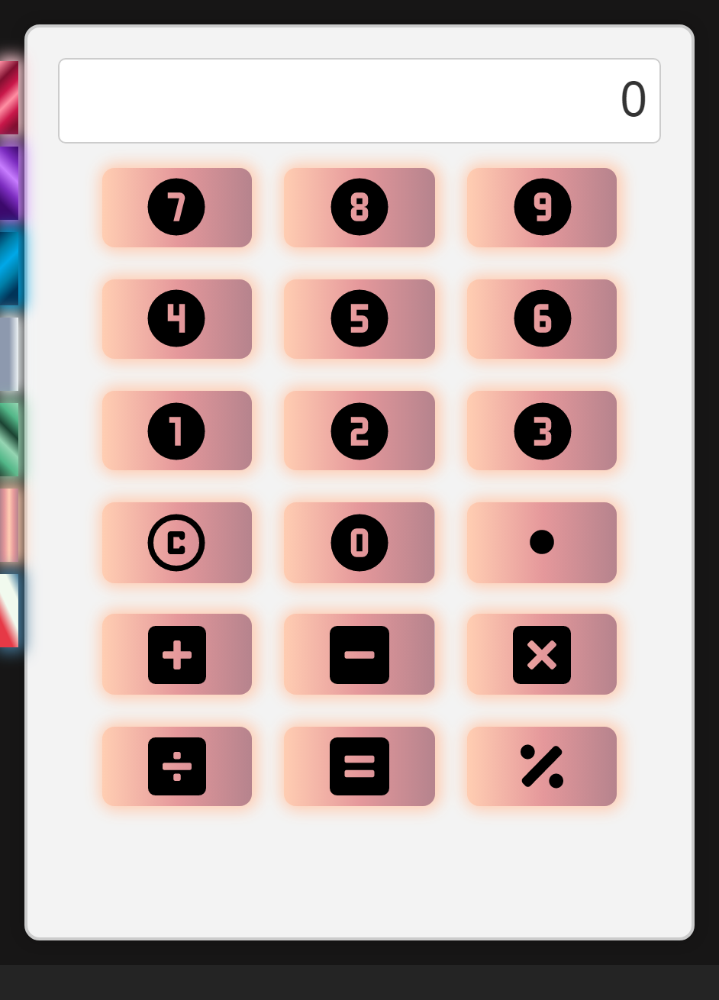

<h1 align="center">Calculator App</h1>

<div align="center">
  <p>A simple calculator application built with React, TypeScript, and Vite. This application allows you to perform basic arithmetic operations, including addition, subtraction, multiplication, division, and percentage calculations.</p>
  
</div>

## Features

- **Addition (+)**
- **Subtraction (-)**
- **Multiplication (\*)**
- **Division (/)**
- **Percentage (%)**
- **Clear (C)**
- **Equals (=)**

## How to Use

1. Click on the calculator buttons to input numbers and perform operations.
2. Use the number buttons (0-9) to input numeric values.
3. Use the operator buttons (+, -, \*, /, %) to perform operations.
4. Click the equals button (=) to calculate the result.
5. Click the clear button (C) to reset the calculator.
6. You can also use the keyboard for input:
   - Type numbers (0-9) to input numeric values.
   - Use the keyboard operators (+, -, \*, /) to perform operations.
   - Press Enter to calculate the result.
   - Press Esc/Detele to clear the calculator.
7. Experiment with different themes and button colors using the dynamic theme changer.

## How to Run

To run the calculator in your browser, follow these steps:

1. **Prerequisites:** Ensure you have [Node.js](https://nodejs.org/) installed on your computer.

2. **Clone:** Clone this repository to your local machine.

   ```
   git clone https://github.com/your-username/calculator-app.git
   ```

3. **Navigate:** Open your terminal and navigate to the project's root directory.

4. **Install Dependencies:** Install the project dependencies by running the following command:

   ```
   npm install
   ```

5. **Start the Development Server:** After the installation is complete, start the development server by running:

   ```
   npm run dev
   ```

6. **Open in Browser:** The calculator app should open in your default web browser. If it doesn't, check the terminal for the URL where the app is running (usually something like `http://localhost:3000`), and open this URL in your web browser.

<div align="center">
  <sub>Created with ❤️ by [PaoloDev](https://github.com/PSuarez18)</sub>
</div>

<h1 align="center">Aplicación de Calculadora</h1>

<div align="center">
  <p>Una sencilla aplicación de calculadora construida con React, TypeScript y Vite. Esta aplicación te permite realizar operaciones aritméticas básicas, incluyendo suma, resta, multiplicación, división y cálculos de porcentaje.</p>
</div>

## Características

- **Suma (+)**
- **Resta (-)**
- **Multiplicación (\*)**
- **División (/)**
- **Porcentaje (%)**
- **Borrar (C)**
- **Igual (=)**

## Cómo Usar

1. Haz clic en los botones de la calculadora para ingresar números y realizar operaciones.
2. Usa los botones de números (0-9) para ingresar valores numéricos.
3. Utiliza los botones de operadores (+, -, \*, /, %) para realizar operaciones.
4. Haz clic en el botón de igual (=) para calcular el resultado.
5. Haz clic en el botón de borrar (C) para reiniciar la calculadora.
6. También puedes usar el teclado para ingresar datos:
   - Escribe números (0-9) para ingresar valores numéricos.
   - Utiliza los operadores del teclado (+, -, \*, /) para realizar operaciones.
   - Presiona Enter para calcular el resultado.
   - Presiona Esc/Delete para borrar la calculadora.
7. Experimenta con diferentes temas y colores de botones usando el cambiador de temas dinámico.

## Cómo Ejecutar

Para ejecutar la calculadora en tu navegador, sigue estos pasos:

1. **Requisitos Previos:** Asegúrate de tener [Node.js](https://nodejs.org/) instalado en tu computadora.

2. **Clonar:** Clona este repositorio en tu máquina local.

   ```
   git clone https://github.com/tu-nombre/aplicacion-de-calculadora.git
   ```

3. **Navegar:** Abre tu terminal y navega hasta el directorio raíz del proyecto.

4. **Instalar Dependencias:** Instala las dependencias del proyecto ejecutando el siguiente comando:

   ```
   npm install
   ```

5. **Iniciar el Servidor de Desarrollo:** Después de que la instalación esté completa, inicia el servidor de desarrollo ejecutando:

   ```
   npm run dev
   ```

6. **Abrir en el Navegador:** La aplicación de la calculadora debería abrirse en tu navegador web por defecto. Si no lo hace, verifica la terminal para obtener la URL donde se está ejecutando la aplicación (generalmente algo como `http://localhost:3000`), y abre esta URL en tu navegador web.

<div align="center">
  <sub>Creado con ❤️ por [PaoloDev](https://github.com/PSuarez18)</sub>
  
</div>
